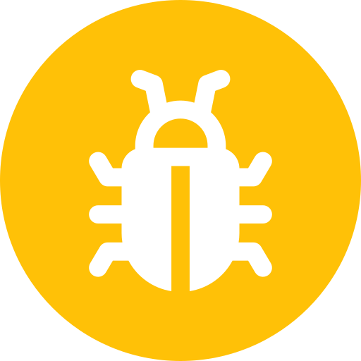
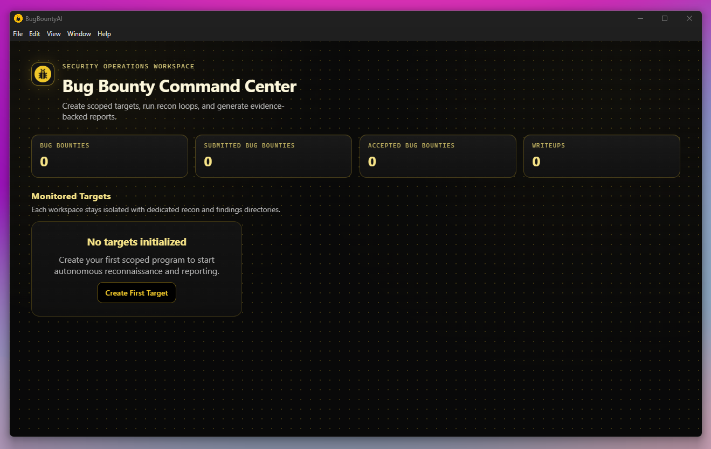

<div align="center">
  
  <h1>BugBountyAI</h1>
  <p><strong>Security Operations Workspace & AI-Augmented Terminal</strong></p>
</div>



## Overview
BugBountyAI is a cross-platform Electron desktop app tailored for security researchers. It provides a dedicated dashboard to manage targets alongside a real Linux shell augmented by a locally hosted LLM. 

## Features
- **Target Dashboard**: Track bug bounties, submitted bugs, accepted bugs, and writeups.
- **AI-Powered Shell**: Explains command outputs in real-time, answers `@` queries, and generates scripts with `#`.
- **Isolated Workspaces**: Each target gets a dedicated recon and findings directory.
- **Safety First**: Full user control via an AI prediction gate. No automated execution without explicit permission.

## Getting Started
```bash
cd app
npm install
npm run dev
```
*Note: Ensure Ollama is running locally for AI features.*
